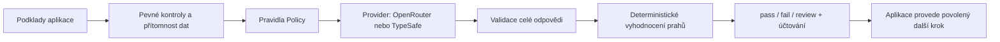

# Architektura a kontrakt 0.1

[🇬🇧 English](architecture.en.md) · **🇨🇿 Česky**
## Cíl a ověření návrhu

Stejné rozhraní musí obsloužit tři scénáře: významový filtr zpráv, kontrolu splnění
zadání programovacího agenta a opravu výstupu po neúspěšné kontrole. Příklady jsou
v `examples/integrations.py` a `examples/offline.py`. Obslužná aplikace nepotřebuje
znát typy Jev Noul/Choice/Score pro běžnou podmínku.

## Hranice modulů

| Modul | Odpovědnost |
|---|---|
| `policy` | Neměnné popisy pravidel, JSON kontrakt, obsahový otisk. |
| `gate` | Jedno posouzení, pevné podmínky, validace podkladů, jednotný výsledek. |
| `engine` | Čisté deterministické vyhodnocení distribucí a skládání kontrol. |
| `providers` / `wire` | Síťový přenos, model a autentizace, omezení velikosti a času. |
| `costs` | Decimal ceny, skutečný účet oddělený od výpočtu z ceníku. |
| `audit` | Volitelný zápis metadat bez článků, promptů a klíčů. |
| `workflow` | Omezená smyčka uživatelských funkcí; žádné samostatné spouštění nástrojů. |
| `cli` | Stejný kontrakt přes JSON pro jiné jazyky a shell. |

## Stabilní pravidla

1. `pass` vyžaduje průchod všech kontrol. Známé nesplnění vede k `fail`;
   jinak chybějící/nejistý výsledek vede k `review`.
2. Pevná podmínka, která selže nebo chybí, zastaví volání modelu. Výsledek má nulový
   účet, protože k volání nedošlo; nesplněné i chybějící body zůstávají viditelné.
3. Hodnotitel vidí všechny otázky dané politiky v jednom dotazu. Odpovědi jedné
   otázky nejsou vstupem jiné; návazná rozhodnutí musí explicitně složit aplikace.
4. `Rule.require` rozlišuje důkazy pro splnění, důkazy pro nesplnění a nedostatek
   důkazů. Nízká jistota a nedostatek podkladů nejsou totéž, obojí může vyžádat review.
5. `Rule.rate` pracuje se součtem pravděpodobností přijatelných stupňů. Průměrné skóre
   se vrací pro inspekci, ale nemůže zamaskovat protichůdnou distribuci.
6. Prahy nejsou naučené z dnešních pokusů. Je třeba je kalibrovat na vlastních datech.
7. Oprávnění, matematika, časové porovnání, build a spouštění testů patří aplikaci.
8. Import nemění pracovní adresář, nepíše soubory a nevolá síť.
9. Chyba poskytovatele znamená `review` a strojový kód chyby. Chyba místní konfigurace
   vyvolá `ConfigurationError`. Chyba cizího vlastního adaptéru se nezamlčí.

## Proč samostatné malé jádro

Integrace do konkrétního agenta je adaptér. Jádro není závislé na LangGraph,
Pydantic AI, webovém frameworku ani na modelu, který připravuje posuzovaný výstup.
V 0.1 nejsou dekorátory skrývající síťové volání, distribuovaný scheduler ani
automatické přepínání modelů. Nový provider implementuje metodu `evaluate`.

## Reprodukovatelnost

Výsledek obsahuje ID a verzi politiky, otisk jejího obsahu včetně formulace zaslaných
otázek, požadovaný a skutečný model, poskytovatele, cenu a délku volání. `expected_model`
umí odmítnout nečekanou změnu modelu. API může aliasy měnit; samotné ID politiky
nestačí pro reprodukovatelnost.
