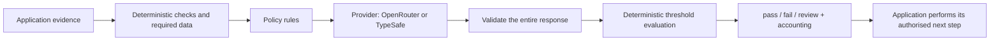

# Architecture and contract 0.1

**🇬🇧 English** · [🇨🇿 Česky](architecture.cz.md)
## Goal and design validation

The same interface serves three scenarios: semantic message filtering, checking
a coding agent's completion and repairing an output after a failed check.
Recipes live in `examples/integrations.py` and `examples/offline.py`. A consumer
does not need to understand Jev's Noul/Choice/Score types for a basic condition.

## Module boundaries

| Module | Responsibility |
|---|---|
| `policy` | Immutable rules, JSON contract and content fingerprint. |
| `gate` | One assessment, fixed conditions, evidence validation and a consistent result. |
| `engine` | Pure deterministic interpretation of distributions and check aggregation. |
| `providers` / `wire` | Transport, model, authentication, size and time limits. |
| `costs` | Decimal amounts, separating the actual bill from price-list calculations. |
| `audit` | Optional metadata without articles, prompts or keys. |
| `workflow` | Bounded user-function loop; no autonomous tool execution. |
| `cli` | The same JSON contract for other languages and the shell. |

## Stable rules

1. `pass` requires all checks to pass. Known failure produces `fail`; otherwise
   missing or uncertain results produce `review`.
2. Failed or missing deterministic checks stop the model request. Cost is zero
   because no request was made; both failed and missing checks remain visible.
3. The evaluator receives all policy questions in one request. One question's
   answer is not another's input; the application must compose dependent decisions.
4. `Rule.require` separates support, contradiction and insufficient evidence.
   Low confidence and insufficient evidence are different, but both may need review.
5. `Rule.rate` sums probability mass for acceptable levels. A mean score is
   available for inspection but cannot conceal a contradictory distribution.
6. Thresholds were not learned from the experiments. Calibrate them on your own data.
7. Permissions, arithmetic, time comparisons, builds and test execution belong
   to the application.
8. Importing changes no working directory, writes no files and makes no requests.
9. Provider errors produce `review` with a machine-readable error code. Invalid
   local configuration raises `ConfigurationError`. Errors in a custom adapter
   are not silently hidden.

## Why a small independent core

Integration with a particular agent is an adapter. The core does not depend on
LangGraph, Pydantic AI, a web framework or the model that generated the assessed
output. Version 0.1 has no decorators hiding network calls, distributed scheduler
or automatic model switching. A new provider implements `evaluate`.

## Reproducibility

Results include policy ID, version and a fingerprint covering the actual questions,
requested and actual model, provider, cost and elapsed time. `expected_model`
can reject an unexpected model change. APIs can change aliases; a policy ID alone
does not establish reproducibility.
